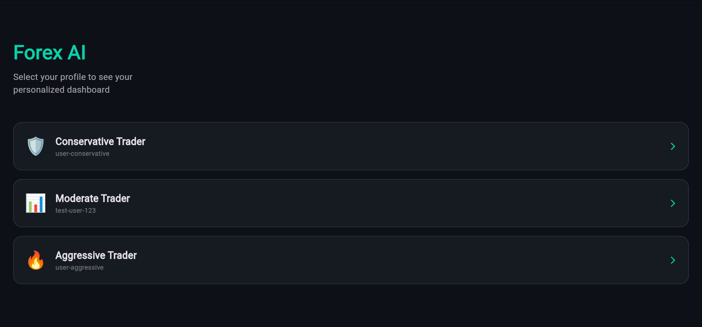
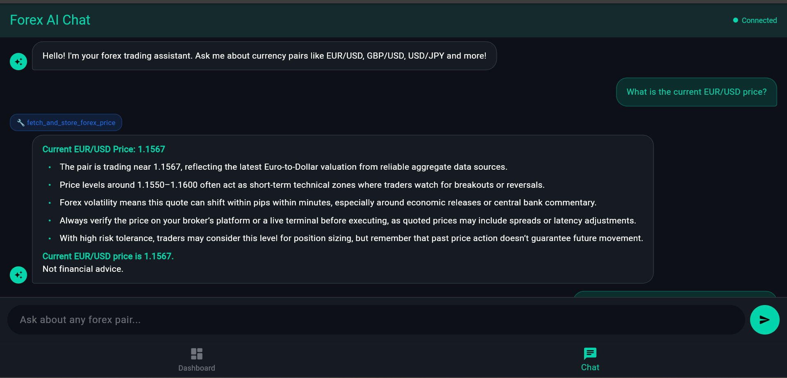

# Forex Trading Agent

AI-powered forex analysis platform — real-time agentic backend, personalized Flutter dashboard, and live chat. Built end-to-end as a full-stack internship project.

---

## What it does

A user opens the app and sees a **personalized dashboard** — an AI gateway reads their risk profile from the database and decides which widgets to render (price cards, sentiment, charts, alerts). No two users see the same screen.

They can also open the **chat tab** and ask the AI agent anything — it autonomously fetches live forex data, chains up to 4 tool calls, and streams the response word by word in real time.

---

## Screenshots

### Personalized Dashboard


### Live Chat


## Stack

| Layer | Technology |
|---|---|
| Agent Framework | LangGraph (deep agent, max depth 4) |
| Backend | FastAPI · PostgreSQL · Docker |
| LLM Provider | OpenRouter (any OpenAI-compatible provider) |
| State Persistence | LangGraph AsyncPostgresSaver |
| Frontend | Flutter Web |
| UI Architecture | Server-Driven UI (SDUI) |

---

## Highlights

- **Server-Driven UI** - backend sends a JSON screen definition; Flutter renders it. No hardcoded screens. Swap components without touching the app.
- **AI gateway** - LLM reads user's risk tolerance, preferred pairs, and response style from DB → selects and orders UI components per user
- **Live chat with streaming** - WebSocket agent streams responses token by token with real-time tool call notifications
- **Autonomous tool chaining** - agent independently decides which tools to call and in what order, up to 4 calls per query
- **Session memory** - conversation persists across disconnects via Postgres-backed LangGraph checkpointer
- **Any currency pair** - not limited to a fixed list, fetches live ECB reference rates for any valid BASE/QUOTE pair
- **Production-ready** - async non-blocking, connection pooling, structured logging, graceful error handling, Dockerized

---

## Run it

```bash
# Backend
cp backend/.env.example backend/.env
# Add your OpenRouter API key to backend/.env
cd backend && docker-compose up --build

# Frontend (in a new terminal)
cd frontend
flutter run -d chrome --web-browser-flag "--disable-web-security"
```

---

## Test it

```bash
cd backend
python test_client.py        # 8-scenario agent test suite
python test_checkpoint.py    # session persistence across reconnects
```

---

## Architecture

```
Flutter App
├── Dashboard Tab   ← SDUI: AI selects components per user
└── Chat Tab        ← WebSocket: real-time streaming agent

Backend (FastAPI)
├── /ui/dashboard   ← AI gateway: reads profile → returns JSON screen
└── /ws             ← WebSocket: LangGraph agent with tool calling

LangGraph Agent
├── Orchestrator    ← tool-calling loop (max depth 4)
├── Personalization ← detects + persists user preferences
├── Classifier      ← structured data extraction (Pydantic)
└── Synthesis       ← free-form streaming response
```